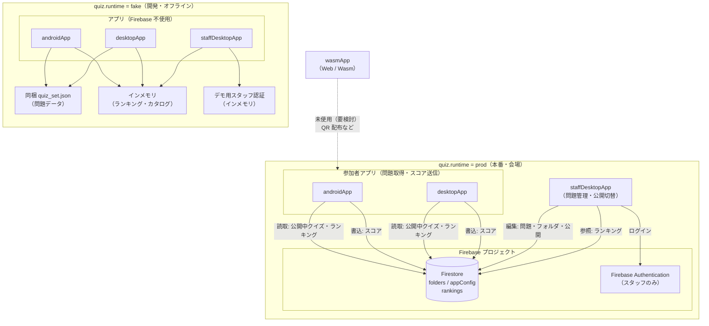

# DroidKaigi 2026 Quiz

Compose Multiplatform クイズアプリ（Android + Desktop + Web/Wasm）。選択式・並び替え問題と当日ランキングに対応。本番は Firestore 等のリモート必須。開発時のみ `fake` でオフライン検証可。

## 構成

- `composeApp` — 共有 UI（Nav3 + adaptive）
- `androidApp` — Android エントリ（参加者向け）
- `desktopApp` — Desktop エントリ（参加者向け）
- `staffComposeApp` / `staffDesktopApp` — **スタッフ用** Desktop（クイズ内容・ランキング確認、PC 運営向け）
- `wasmApp` — Web（Wasm）エントリ
- `core:domain` / `core:data` / `core:ui`
- `feature:quiz` / `feature:ranking` / `feature:staff`

仕様: [docs/SPEC.md](docs/SPEC.md) · AI 向け: [AGENTS.md](AGENTS.md)

## ランタイムバリアント（fake / prod）

データ層は **2 つのランタイム** を持ち、ビルド時にどちらか一方だけがコンパイルされます（`src/fakeMain` または `src/prodMain` を `commonMain` に載せ替え + Metro グラフ切り替え）。

| バリアント | `quiz.runtime` | 内容 |
|------------|----------------|------|
| **fake**（デフォルト） | `fake` | **開発専用**: 同梱 JSON（`quiz_set.json`）とインメモリランキング。ネット不要で UI・採点を検証。 |
| **prod** | `prod` | **本番**: 問題・ランキングとも Firestore 必須（`RemoteQuizCatalogRepository` / `RemoteRankingRepository` 等）。`core/data/src/prodMain` に実装。オフライン非対応。 |

### 全体像（fake / prod と Firebase）

`quiz.runtime` で **データ層だけ** が切り替わります。UI モジュール（参加者・スタッフ）は共通で、ビルド時に fake 用 / prod 用の Repository が載せ替わります。



要点:

| 観点 | fake | prod |
|------|------|------|
| **問題データ** | リポジトリ同梱 JSON | **Firestore** `folders/{folderId}` |
| **問題の編集** | スタッフアプリ → インメモリ（再起動で消える） | **スタッフアプリ** → Firebase Auth 後に Firestore へ保存 |
| **参加者アプリ** | Android / Desktop（ネット不要） | Android / Desktop（Firestore 必須） |
| **Wasm** | ビルド可能だが本番未採用 | 同上（要検討） |

### 切り替え方

| プラットフォーム | 切り替え |
|------------------|----------|
| **Android** | **Build Variant**（下記 [Android Build Variant](#android-build-variantruntime-flavor)） |
| **Desktop / スタッフ** | [gradle.properties](gradle.properties) の `quiz.runtime` または `-Pquiz.runtime=prod` |

### Android Build Variant（`runtime` flavor）

参加者 Android（`:androidApp`）だけ **AGP の productFlavor** で fake / prod を切り替えます。KMP ライブラリ（`:composeApp` / `:core:data` など）は [Android-KMP プラグイン](https://developer.android.com/kotlin/multiplatform/plugin)の都合で **flavor を持たない**ため、同じビルド内の `quiz.runtime` は [gradle/quiz-runtime.gradle.kts](gradle/quiz-runtime.gradle.kts) で 1 つに揃えます。

| Build Variant | productFlavor | `quiz.runtime`（KMP） | データ源 | パッケージ名（例） |
|---------------|---------------|----------------------|----------|-------------------|
| **fakeDebug**（既定） | `fake` | `fake` | 同梱 JSON + インメモリ | `com.droidkaigi.quiz.fake` |
| **prodDebug** | `prod` | `prod` | Firestore | `com.droidkaigi.quiz` |
| fakeRelease / prodRelease | 同上 | 同上 | 同上 | 同上 |

`quiz.runtime` の決まり方（優先順）:

1. Gradle タスク名に含まれる flavor（`assembleProdDebug` → `prod`）
2. `-Pquiz.runtime=…` または [gradle.properties](gradle.properties)
3. 既定 `fake`

そのため **`gradle.properties` が `quiz.runtime=fake` のままでも、`prodDebug` をビルドすれば KMP は prod** になります（逆に、Variant を prod にしても Gradle Sync だけでは KMP が fake のまま、ということはありません。**インストールする APK を prodDebug でビルドしたか**が重要です）。

**Android Studio の手順**

1. **View → Tool Windows → Build Variants**
2. モジュール `:androidApp` を **fakeDebug** または **prodDebug** に変更
3. **Build → Rebuild Project**（Variant 切替後は必須）
4. Run 設定 [`.run/androidApp.run.xml`](.run/androidApp.run.xml) などで `:androidApp` を実行

**Firebase（prod のみ）**

- `google-services` プラグインは **prod ビルド時のみ** 適用（`quiz.runtime=prod`）
- 設定ファイル: [`androidApp/src/prod/google-services.json`](androidApp/src/prod/google-services.json)（`package_name` は `com.droidkaigi.quiz` と一致）
- ルートの [`androidApp/google-services.json`](androidApp/google-services.json) は Desktop JVM の設定読み込み用として残してよい

**注意**

- fake と prod の APK は **別アプリ**として端末に共存可能（applicationId が異なる）
- `./gradlew :androidApp:assembleFakeDebug :androidApp:assembleProdDebug` のように **1 コマンドで両 flavor を並べると KMP は fake にフォールバック**する。片方ずつビルドする
- prod なのにデモ問題が出る → **fakeDebug の APK が入っている**か、Rebuild 不足。ログに `quiz.runtime resolved to 'prod'` が出るか確認

**永続的に変える（Desktop など）** — ルートの `gradle.properties`:

```properties
quiz.runtime=fake
# quiz.runtime=prod
```

**1 回だけ上書き**:

```bash
./gradlew -Pquiz.runtime=prod ...
```

Desktop / Wasm では上記 [切り替え方](#切り替え方) の `gradle.properties` または `-Pquiz.runtime` を使います。`quiz.runtime` を変更したあとは、**必ず再ビルド**してください（選ばれていない側の source set はコンパイルされません）。

### prod と Firestore（問題 DB・ランキング）

`quiz.runtime=prod` では参加者アプリが **Firestore** からクイズとランキングを読み書きする想定です（実装は `core/data/src/prodMain` の `RemoteQuizCatalogRepository` / `RemoteRankingRepository` など。現状はスタブ）。

| 用途 | fake（開発・デモ） | prod（本番） |
|------|-------------------|--------------|
| 参加者 Android / Desktop / Wasm | 同梱 JSON + プロセス内ランキング | Firestore（読み取り + スコア送信） |
| スタッフ Desktop（`staffDesktopApp`） | インメモリ認証・カタログ（ローカル固定値） | **Firebase Authentication** + Firestore（フォルダ編集・公開・ランキング参照） |

スタッフも参加者と同じ `quiz.runtime` で切り替えます（`staffComposeApp` の Metro グラフと `core:data` の fake/prod が連動）。**fake はあくまで開発用**、会場本番の運営 PC は `prod` を想定しています。

コレクション構成・設計意図・シード・ルール・インデックスは [docs/FIRESTORE.md](docs/FIRESTORE.md) を参照（README では重複記載しない）。

#### Firebase プロジェクトの設定手順

1. [Firebase Console](https://console.firebase.google.com/) でプロジェクトを作成する。
2. **Firestore Database** を作成する（本番は **本番モード** で開始し、[docs/FIRESTORE.md](docs/FIRESTORE.md#セキュリティルール) のルールをすぐ適用。テスト用に全開放ルールのままにしない）。
3. **Android アプリを登録**（パッケージ名 `com.droidkaigi.quiz` = `:androidApp` の `applicationId`）。
4. ダウンロードした `google-services.json` を **`androidApp/google-services.json`** に置く（リポジトリには含めない。`.gitignore` 済み想定）。
5. Android 側で Firebase / Firestore SDK を有効化する（未導入の場合の例）:
   - ルート `build.gradle.kts` に Google Services プラグイン
   - `:androidApp` に `com.google.gms.google-services` と `firebase-firestore`（または KMP 向け [GitLive firebase-kotlin-sdk](https://github.com/GitLiveApp/firebase-kotlin-sdk) を `core:data` の `prodMain` から利用）
6. **Desktop / Wasm** も prod で Firestore を使う場合は、同じプロジェクトの Web API キーまたは GitLive の各ターゲット設定が必要（プラットフォームごとに `prodMain` でクライアント初期化）。
7. **ルール・インデックス**を Firebase CLI で反映（推奨）: [docs/FIRESTORE.md](docs/FIRESTORE.md#firebase-cli-でデプロイ) — リポジトリの `firebase.json` / `firestore.rules` / `.firebaserc` を使用し `firebase deploy --only firestore`。

**初期データ**は [docs/FIRESTORE.md#初期データ](docs/FIRESTORE.md#初期データ)（[firestore-seed.json](docs/firestore-seed.json)）を参照。

**環境の切り分け**

- **開発**: `quiz.runtime=fake`（既定）— 同梱 JSON + インメモリランキングでオフライン検証。本番仕様の代替ではない。
- **結合・会場**: `-Pquiz.runtime=prod` + 検証用 Firebase プロジェクト（本番プロジェクトと分ける）。問題取得・ランキング表示・スコア送信はすべてネット必須。
- シークレット（`google-services.json`、API キー）は CI では暗号化シークレットや環境変数から生成し、コミットしない。

**実装メモ（コード側）**

- `RemoteQuizCatalogRepository` が上記 `folders` / `appConfig` をマッピングする。
- prod では `QuizRepository` / `getDefaultQuizSet` は使わない。参加者・スタッフとも `QuizCatalogRepository` 経由。
- `RemoteRankingRepository` は `folders/{folderId}/rankings` を `dateKey` + `score` でクエリし、`InstantProvider` の「当日」と揃える。

### ビルド・実行例

Android（fake）:

```bash
./gradlew :androidApp:assembleFakeDebug
```

Android（prod）— `androidApp/src/prod/google-services.json` が必要:

```bash
./gradlew :androidApp:assembleProdDebug
```

Android Studio の詳細は [Android Build Variant](#android-build-variantruntime-flavor) を参照。

Desktop（fake）:

```bash
./gradlew :desktopApp:run
```

Desktop（prod）— **JDK 17 以上**（GitLive `firebase-java-sdk` の要件）:

```bash
./gradlew :desktopApp:run -Pquiz.runtime=prod
```

スタッフ用 Desktop（**開発・既定は fake**）:

```bash
./gradlew :staffDesktopApp:run
```

`fake` 時は参加者アプリと別プロセスのため、ランキングはプロセス内メモリのみ（デモデータ + そのセッションの操作）。会場本番では `-Pquiz.runtime=prod` で参加者と同じ Firestore を参照。詳細は [docs/VERIFY.md](docs/VERIFY.md)。

テスト（fake 向けの data テストは `quiz.runtime=fake` のときのみ有効）:

```bash
./gradlew :core:data:jvmTest
./gradlew :core:data:jvmTest -Pquiz.runtime=prod   # prod では Fake 専用テストは除外
```

## ビルド

AGP 9.x + Gradle 9.4。Android アプリは `:androidApp` モジュールです。ランタイムの詳細は上記「ランタイムバリアント」を参照。

```bash
./gradlew :androidApp:assembleDebug
```

## テスト

```bash
./gradlew :core:domain:jvmTest :core:data:jvmTest
./gradlew :androidApp:connectedDebugAndroidTest  # 要エミュレータ
```

## Desktop

参加者向け:

```bash
./gradlew :desktopApp:run
```

## スタッフ用 Desktop

運営 PC 向け。フォルダ（日・難易度など）ごとにクイズとランキングを管理。問題の追加・編集、解説（Markdown 風プレビュー）、「参加者向けに公開」でアクティブフォルダを切り替え。起動時にスタッフ認証画面（fake: デモ用アカウント、prod: Firebase Auth 予定）。

**開発（fake・既定）**

```bash
./gradlew :staffDesktopApp:run
```

デモ用ログイン: `staff@droidkaigi.local` / `staff2026`（インメモリのみ）。

**本番（prod）** — **JDK 17 以上**（参加者 Desktop prod と同様）

```bash
./gradlew :staffDesktopApp:run -Pquiz.runtime=prod
```

`core/data` の prod 実装（Firestore + `ProdStaffAuthRepository`）と `ProdStaffQuizAppGraph` が有効になります。Firebase プロジェクト・Auth の設定は上記「prod と Firestore」を参照。

## Web (Wasm)

Chrome 119+ など Wasm GC 対応ブラウザが必要です。

> **注釈（Wasm）**  
> 現在は仮で追加しており、イベント時にいろんな方が QR 経由等でアクセスする等を想定（要検討）。

```bash
./gradlew :wasmApp:wasmJsBrowserDevelopmentRun
```

## 手動確認

[docs/VERIFY.md](docs/VERIFY.md)
