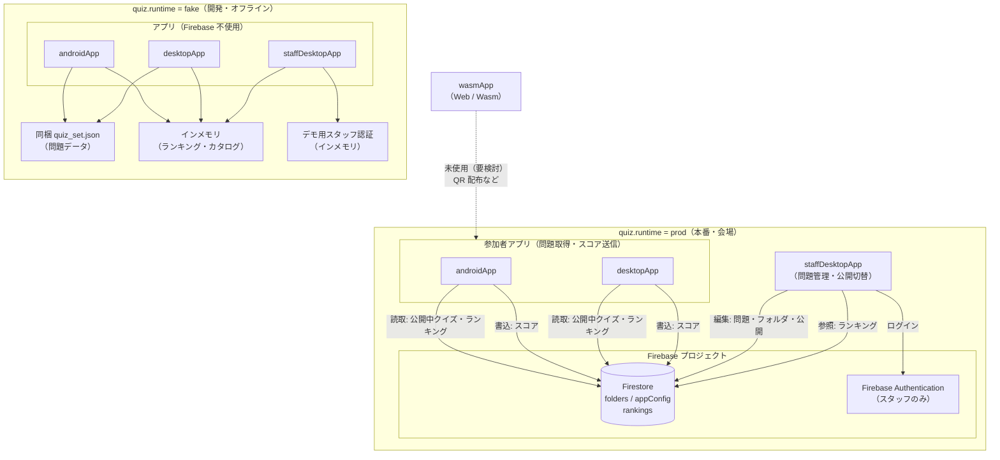

# 開発環境・ビルド

初めて触る方は先に [CONTRIBUTING.md](CONTRIBUTING.md)（参加方法・PR・レビュー）を読んでください。

## リポジトリ構成

- `composeApp` — 共有 UI（Nav3 + adaptive）
- `androidApp` — Android エントリ（参加者向け）
- `desktopApp` — Desktop エントリ（参加者向け）
- `staffComposeApp` / `staffDesktopApp` — **スタッフ用** Desktop（クイズ内容・ランキング確認、PC 運営向け）
- `wasmApp` — Web（Wasm）エントリ（未運用）
- `core:domain` / `core:data` / `core:ui`
- `feature:quiz` / `feature:ranking` / `feature:staff`

## ランタイムバリアント（fake / prod）

データ層は **2 つのランタイム** を持ち、ビルド時にどちらか一方だけがコンパイルされます（`src/fakeMain` または `src/prodMain` を `commonMain` に載せ替え + Metro グラフ切り替え）。

| バリアント | `quiz.runtime` | 内容 |
|------------|----------------|------|
| **fake**（デフォルト） | `fake` | **開発専用**: 同梱 JSON（`quiz_set.json`）とインメモリランキング。ネット不要で UI・採点を検証。 |
| **prod** | `prod` | **本番**: 問題・ランキングとも Firestore 必須（`RemoteQuizCatalogRepository` / `RemoteRankingRepository` 等）。`core/data/src/prodMain` に実装。オフライン非対応。 |

### 全体像（fake / prod と Firebase）

`quiz.runtime` で **データ層だけ** が切り替わります。UI モジュール（参加者・スタッフ）は共通で、ビルド時に fake 用 / prod 用の Repository が載せ替わります。



要点:

| 観点 | fake | prod |
|------|------|------|
| **問題データ** | リポジトリ同梱 JSON | **Firestore** `folders/{folderId}` |
| **問題の編集** | スタッフアプリ → インメモリ（再起動で消える） | **スタッフアプリ** → Firebase Auth 後に Firestore へ保存 |
| **参加者アプリ** | Android / Desktop（ネット不要） | Android / Desktop（Firestore 必須） |
| **Wasm** | ビルド可能だが本番未採用 | 同上（要検討） |

### 切り替え方

| プラットフォーム | 切り替え |
|------------------|----------|
| **Android** | **Build Variant**（下記 [Android Build Variant](#android-build-variantruntime-flavor)） |
| **JVM（Desktop / スタッフ）** | [gradle.properties](../gradle.properties) の `quiz.runtime`、`-Pquiz.runtime=prod`、または Android Studio の Run Configuration（下記 [JVM（Desktop / スタッフ）](#jvmdesktop--スタッフ)） |

### JVM（Desktop / スタッフ）

参加者 Desktop（`:desktopApp`）とスタッフ Desktop（`:staffDesktopApp`）は JVM ターゲット。`quiz.runtime` は [gradle.properties](../gradle.properties) または `-Pquiz.runtime=prod` で切り替える。

**Android Studio（スタッフ Desktop）**

Run Configuration で切り替えて実行できる（`.run/staffDesktop[Fake].run.xml` / `.run/staffDesktop[Prod] .run.xml`）。

1. ツールバーの Run Configuration ドロップダウンを開く
2. **`staffDesktop[Fake]`**（fake）または **`staffDesktop[Prod]`**（prod）を選択
3. Run（`:staffDesktopApp:run` が実行される。Prod は `-Pquiz.runtime=prod` 付き）

`quiz.runtime` を変更したあとは、**必ず再ビルド**してください（選ばれていない側の source set はコンパイルされません）。

### Android Build Variant（`runtime` flavor）

参加者 Android（`:androidApp`）だけ **AGP の productFlavor** で fake / prod を切り替えます。KMP ライブラリ（`:composeApp` / `:core:data` など）は [Android-KMP プラグイン](https://developer.android.com/kotlin/multiplatform/plugin)の都合で **flavor を持たない**ため、同じビルド内の `quiz.runtime` は [gradle/quiz-runtime.gradle.kts](../gradle/quiz-runtime.gradle.kts) で 1 つに揃えます。

| Build Variant | productFlavor | `quiz.runtime`（KMP） | データ源 | パッケージ名（例） |
|---------------|---------------|----------------------|----------|-------------------|
| **fakeDebug**（既定） | `fake` | `fake` | 同梱 JSON + インメモリ | `com.droidkaigi.quiz.fake` |
| **prodDebug** | `prod` | `prod` | Firestore | `com.droidkaigi.quiz` |
| fakeRelease / prodRelease | 同上 | 同上 | 同上 | 同上 |

`quiz.runtime` の決まり方（優先順）:

1. Gradle タスク名に含まれる flavor（`assembleProdDebug` → `prod`）
2. `-Pquiz.runtime=…` または [gradle.properties](../gradle.properties)
3. 既定 `fake`

そのため **`gradle.properties` が `quiz.runtime=fake` のままでも、`prodDebug` をビルドすれば KMP は prod** になります（逆に、Variant を prod にしても Gradle Sync だけでは KMP が fake のまま、ということはありません。**インストールする APK を prodDebug でビルドしたか**が重要です）。

**Android Studio の手順**

1. **View → Tool Windows → Build Variants**
2. モジュール `:androidApp` を **fakeDebug** または **prodDebug** に変更
3. **Build → Rebuild Project**（Variant 切替後は必須）
4. Run 設定 [`.run/androidApp.run.xml`](../.run/androidApp.run.xml) などで `:androidApp` を実行

**Firebase プロジェクト（prod）**: [Firebase セットアップ](#firebase-セットアップ) を完了してから `prodDebug` / `-Pquiz.runtime=prod` で結合確認する。

**注意**

- fake と prod の APK は **別アプリ**として端末に共存可能（applicationId が異なる）
- `./gradlew :androidApp:assembleFakeDebug :androidApp:assembleProdDebug` のように **1 コマンドで両 flavor を並べると KMP は fake にフォールバック**する。片方ずつビルドする
- prod なのにデモ問題が出る → **fakeDebug の APK が入っている**か、Rebuild 不足。ログに `quiz.runtime resolved to 'prod'` が出るか確認

**永続的に変える（Desktop など）** — ルートの `gradle.properties`:

```properties
quiz.runtime=fake
# quiz.runtime=prod
```

**1 回だけ上書き**:

```bash
./gradlew -Pquiz.runtime=prod ...
```

Desktop / Wasm では上記 [切り替え方](#切り替え方) の `gradle.properties` または `-Pquiz.runtime` を使う。スタッフ Desktop は Android Studio では [JVM（Desktop / スタッフ）](#jvmdesktop--スタッフ) の Run Configuration でも切り替え可能。

## Firebase セットアップ

`quiz.runtime=prod` で Firestore・Firebase Authentication を使うための手順。データ構造・ルール・シードの詳細は [FIRESTORE.md](FIRESTORE.md) を参照。

### リポジトリ内の Firebase ファイル

| パス | 内容 | 状態 |
|------|------|------|
| [.firebaserc](../.firebaserc) | CLI のデフォルトプロジェクト ID（`droidkaigi26`） | 本番プロジェクトに合わせて更新可 |
| [firebase.json](../firebase.json) | Firestore ルール・インデックス、Wasm 向け Hosting | Hosting は将来用（未デプロイ） |
| [firestore.rules](../firestore.rules) | Firestore セキュリティルール | `firebase deploy --only firestore` で反映 |
| [firestore.indexes.json](../firestore.indexes.json) | 複合インデックス定義 | 同上 |
| [functions/](../functions/) | Cloud Functions（Python）の雛形 | **未使用**（`firebase.json` 未登録・デプロイ不要） |
| [androidApp/google-services.json.example](../androidApp/google-services.json.example) | Android / Desktop 用設定のテンプレート | 各自のプロジェクト用にコピーして編集 |
| [androidApp/src/prod/google-services.json](../androidApp/src/prod/google-services.json) | Android `prod` flavor 用（リポジトリ同梱） | `com.droidkaigi.quiz` 向け |
| [docs/firestore-seed.json](firestore-seed.json) | 初期データのサンプル | Console 投入またはスタッフアプリで再現 |

### 1. 前提ツール

- [Firebase CLI](https://firebase.google.com/docs/cli)（`npm install -g firebase-tools`）
- Firebase プロジェクトへの編集権限（本番は `droidkaigi26`。別プロジェクトを使う場合は [.firebaserc](../.firebaserc) を更新）

```bash
firebase login
firebase projects:list   # 権限確認
```

### 2. Firebase Console で有効化

[Firebase Console](https://console.firebase.google.com/) で対象プロジェクトを開き、次を有効にする。

| サービス | 設定 |
|----------|------|
| **Firestore** | 本番モードで作成（リージョンは運用方針に合わせる） |
| **Authentication** | サインイン方法 → **メール / パスワード** を有効化 |

参加者アプリは匿名で Firestore を読み書きする（ルールは [firestore.rules](../firestore.rules) 参照）。スタッフアプリだけ Firebase Auth でログインする。

### 3. `google-services.json` の配置

| 用途 | 配置先 | 備考 |
|------|--------|------|
| Android `prodDebug` / `prodRelease` | `androidApp/src/prod/google-services.json` | パッケージ名は **`com.droidkaigi.quiz`**（`prod` flavor の applicationId と一致） |
| Desktop / スタッフ Desktop（`run`） | `androidApp/google-services.json` | **gitignore 対象**。ローカルでコピーして使う |

Console から Android アプリ（`com.droidkaigi.quiz`）を登録し、JSON をダウンロードする。テンプレートは [google-services.json.example](../androidApp/google-services.json.example) を参照。

Desktop 向けは、リポジトリ同梱の prod 用ファイルをコピーするのが手早い:

```bash
cp androidApp/src/prod/google-services.json androidApp/google-services.json
```

別パスを使う場合は JVM 起動時に `-Ddroidkaigi.firebase.config=/絶対パス/google-services.json` を指定できる（[GoogleServicesLoader](../core/data/src/prodJvm/kotlin/com/droidkaigi/quiz/core/data/firestore/GoogleServicesLoader.kt) が解決）。

### 4. スタッフ用アカウント

Firebase Console → **Authentication** → **ユーザーを追加** でスタッフ用メール・パスワードを作成する。`staffDesktopApp` の prod 実行時にこのアカウントでログインする（fake の `staff@droidkaigi.local` / `staff2026` は prod では使えない）。

### 5. Firestore のデプロイと初期データ

ルール・インデックスのデプロイ、シード投入は [FIRESTORE.md#firebase-cli-でデプロイ](FIRESTORE.md#firebase-cli-でデプロイ) を参照。

```bash
firebase deploy --only firestore:rules,firestore:indexes
```

### 6. prod アプリの起動確認

セットアップ後、次で結合確認する（手順の詳細は [VERIFY.md](VERIFY.md)）。

```bash
./gradlew :androidApp:assembleProdDebug
./gradlew :staffDesktopApp:run -Pquiz.runtime=prod
./gradlew :desktopApp:run -Pquiz.runtime=prod
```

ログに `quiz.runtime resolved to 'prod'` が出ること、スタッフアプリで Firebase Auth ログイン後にフォルダ編集が Firestore に反映されることを確認する。

### 7. Wasm Hosting（将来用・任意）

現時点では未運用。将来ブラウザ配布する場合の参考:

```bash
./gradlew :wasmApp:wasmJsBrowserProductionWebpack
firebase deploy --only hosting
```

`firebase.json` の `hosting.public` は `wasmApp/build/dist/wasmJs/productionExecutable` を指す。

### 8. Cloud Functions（未使用）

[functions/](../functions/) は Python の雛形のみ。**`firebase.json` に未登録**で、利用予定もない。将来使う場合は `firebase init functions` 相当の設定を追加してからデプロイする。

**環境の切り分け**

- **開発**: `quiz.runtime=fake`（既定）— 同梱 JSON + インメモリランキングでオフライン検証。本番仕様の代替ではない。
- **結合・会場（prod）**: 上記セットアップ完了後、Firestore + Firebase Auth を使用

コード上の Repository マッピング・prod 取得経路は [FIRESTORE.md#アプリからのマッピング](FIRESTORE.md#アプリからのマッピング) を参照。

## ビルド・実行

AGP 9.x + Gradle 9.4。Android アプリは `:androidApp` モジュール。

### 参加者 — Android

```bash
./gradlew :androidApp:assembleFakeDebug    # 開発（fake）
./gradlew :androidApp:assembleProdDebug    # prod（要 [Firebase セットアップ](#firebase-セットアップ)）
./gradlew :androidApp:assembleDebug        # 既定 Variant に依存
```

Android Studio の Variant 手順は [Android Build Variant](#android-build-variantruntime-flavor) を参照。

### 参加者 — Desktop

```bash
./gradlew :desktopApp:run                                    # fake（既定）
./gradlew :desktopApp:run -Pquiz.runtime=prod                # prod（JDK 17+）
```

### スタッフ — Desktop

```bash
./gradlew :staffDesktopApp:run                               # fake（既定）
./gradlew :staffDesktopApp:run -Pquiz.runtime=prod           # prod（JDK 17+）
```

Android Studio では Run Configuration **`staffDesktop[Fake]`** / **`staffDesktop[Prod]`** の切り替えでも fake / prod を選べる（[JVM（Desktop / スタッフ）](#jvmdesktop--スタッフ)）。

- **fake**: デモログイン `staff@droidkaigi.local` / `staff2026`（インメモリ）。参加者アプリとは別プロセスのためランキングはプロセス内のみ。
- **prod**: [Firebase セットアップ](#firebase-セットアップ) 後、Console で作成したスタッフアカウントでログイン

### Web（Wasm）

Chrome 119+ など Wasm GC 対応ブラウザが必要。本番未採用（要検討）。

```bash
./gradlew :wasmApp:wasmJsBrowserDevelopmentRun
```

## テスト

```bash
./gradlew :core:domain:jvmTest :core:data:jvmTest
./gradlew :core:data:jvmTest -Pquiz.runtime=prod   # prod では Fake 専用テストは除外
./gradlew :androidApp:connectedDebugAndroidTest    # 要エミュレータ
```

## 手動確認

[VERIFY.md](VERIFY.md)（会場・prod 結合の確認手順を含む）
