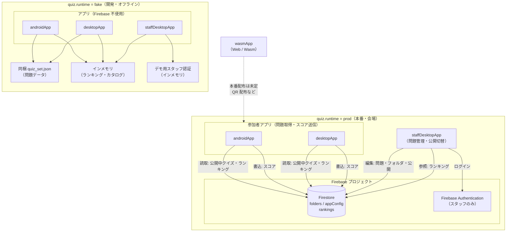

# 開発環境・ビルド

初めて触る方は先に [CONTRIBUTING.md](CONTRIBUTING.md)（参加方法・PR・レビュー）を読んでください。

## リポジトリ構成

- `composeApp` — 共有 UI（Nav3 + adaptive）
- `androidApp` — Android エントリ（参加者向け）
- `desktopApp` — Desktop エントリ（参加者向け）
- `staffComposeApp` / `staffDesktopApp` — **スタッフ用** Desktop（クイズ内容・ランキング確認、PC 運営向け）
- `wasmApp` — Web（Wasm）エントリ（fake / prod 両対応。CI でビルド検証。`master` マージで Firebase Hosting 本番デプロイ、PR でプレビューチャネル）
- `core:domain` / `core:data` / `core:ui`
- `feature:quiz` / `feature:ranking` / `feature:staff`

## ランタイムバリアント（fake / prod）

データ層は **2 つのランタイム** を持ち、ビルド時にどちらか一方だけがコンパイルされます（`src/fakeMain` または `src/prodMain` を `commonMain` に載せ替え + Metro グラフ切り替え）。

| バリアント | `quiz.runtime` | 内容 |
|------------|----------------|------|
| **fake**（デフォルト） | `fake` | **開発専用**: 同梱 [quiz_set.json](../core/data/src/commonMain/composeResources/files/quiz_set.json) とインメモリランキング。ネット不要で UI・採点を検証。 |
| **prod** | `prod` | **本番**: 問題・ランキングとも Firestore 必須（`RemoteQuizCatalogRepository` / `RemoteRankingRepository` 等）。`core/data/src/prodMain` に実装。オフライン非対応。 |

### 全体像（fake / prod と Firebase）

`quiz.runtime` で **データ層だけ** が切り替わります。UI モジュール（参加者・スタッフ）は共通で、ビルド時に fake 用 / prod 用の Repository が載せ替わります。


```mermaid
flowchart TB
  subgraph fake["quiz.runtime = fake（開発・オフライン）"]
    direction TB
    FJSON["同梱 quiz_set.json<br/>（問題データ）"]
    FMEM["インメモリ<br/>（ランキング・カタログ）"]
    FAUTH["デモ用スタッフ認証<br/>（インメモリ）"]

    subgraph fakeApps["アプリ（Firebase 不使用）"]
      FA["androidApp"]
      FD["desktopApp"]
      FS_APP["staffDesktopApp"]
    end

    FA --> FJSON
    FA --> FMEM
    FD --> FJSON
    FD --> FMEM
    FS_APP --> FAUTH
    FS_APP --> FMEM
  end

  subgraph prod["quiz.runtime = prod（本番・会場）"]
    direction TB
    subgraph firebase["Firebase プロジェクト"]
      FSDB[("Firestore<br/>folders / appConfig<br/>rankings")]
      AUTH["Firebase Authentication<br/>（スタッフのみ）"]
    end

    subgraph prodParticipant["参加者アプリ（問題取得・スコア送信）"]
      PA["androidApp"]
      PD["desktopApp"]
    end

    STAFF["staffDesktopApp<br/>（問題管理・公開切替）"]

    PA -->|"読取: 公開中クイズ・ランキング"| FSDB
    PA -->|"書込: スコア"| FSDB
    PD -->|"読取: 公開中クイズ・ランキング"| FSDB
    PD -->|"書込: スコア"| FSDB

    STAFF -->|"ログイン"| AUTH
    STAFF -->|"編集: 問題・フォルダ・公開"| FSDB
    STAFF -->|"参照: ランキング"| FSDB
  end

  WASM["wasmApp<br/>（Web / Wasm）"]
  WASM -.->|"本番配布は未定<br/>QR 配布など"| prodParticipant
```

要点:

| 観点 | fake | prod |
|------|------|------|
| **問題データ** | リポジトリ同梱 JSON | **Firestore** `folders/{folderId}` |
| **問題の編集** | スタッフアプリ → インメモリ（再起動で消える） | **スタッフアプリ** → Firebase Auth 後に Firestore へ保存 |
| **参加者アプリ** | Android / Desktop（ネット不要） | Android / Desktop（Firestore 必須） |
| **Wasm** | 動作対象（CI でビルド検証） | Firebase JS SDK で Firestore / Auth に接続（ビルド時に google-services.json が必要） |

### 初期データ（fake）

`quiz.runtime=fake` で使う問題データは、同梱の [quiz_set.json](../core/data/src/commonMain/composeResources/files/quiz_set.json) のみ。`FakeQuizCatalogSeeder` が起動時にインメモリ catalog へ投入する。ランキングもインメモリ（再起動で消える）。

[firestore-seed.json](firestore-seed.json) は、同じデモ問題を **Firestore ドキュメント形式**で示した参考 JSON（fake 実行時には読み込まない。prod の Firestore 仕様を理解するための対応表）。

### 切り替え方

| プラットフォーム | 切り替え |
|------------------|----------|
| **Android** | **Build Variant**（下記 [Android Build Variant](#android-build-variantruntime-flavor)） |
| **JVM（Desktop / スタッフ）** | [gradle.properties](../gradle.properties) の `quiz.runtime`、`-Pquiz.runtime=prod`、または Android Studio の Run Configuration（下記 [JVM（Desktop / スタッフ）](#jvmdesktop--スタッフ)） |

### JVM（Desktop / スタッフ）

参加者 Desktop（`:desktopApp`）とスタッフ Desktop（`:staffDesktopApp`）は JVM ターゲット。`quiz.runtime` は [gradle.properties](../gradle.properties) または `-Pquiz.runtime=prod` で切り替える。

**Android Studio（スタッフ Desktop）**

Run Configuration で切り替えて実行できる（`.run/staffDesktop[Fake].run.xml` / `.run/staffDesktop[Prod] .run.xml`）。

1. ツールバーの Run Configuration ドロップダウンを開く
2. **`staffDesktop[Fake]`**（fake）または **`staffDesktop[Prod]`**（prod）を選択
3. Run（`:staffDesktopApp:run` が実行される。Prod は `-Pquiz.runtime=prod` 付き）

`quiz.runtime` を変更したあとは、**必ず再ビルド**してください（選ばれていない側の source set はコンパイルされません）。

### Android Build Variant（`runtime` flavor）

参加者 Android（`:androidApp`）だけ **AGP の productFlavor** で fake / prod を切り替えます。KMP ライブラリ（`:composeApp` / `:core:data` など）は [Android-KMP プラグイン](https://developer.android.com/kotlin/multiplatform/plugin)の都合で **flavor を持たない**ため、同じビルド内の `quiz.runtime` は [gradle/quiz-runtime.gradle.kts](../gradle/quiz-runtime.gradle.kts) で 1 つに揃えます。

| Build Variant | productFlavor | `quiz.runtime`（KMP） | データ源 | パッケージ名（例） |
|---------------|---------------|----------------------|----------|-------------------|
| **fakeDebug**（既定） | `fake` | `fake` | 同梱 JSON + インメモリ | `jp.co.yumemi.quiz.droidkaigi.fake` |
| **prodDebug** | `prod` | `prod` | Firestore | `jp.co.yumemi.quiz.droidkaigi` |
| fakeRelease / prodRelease | 同上 | 同上 | 同上 | 同上 |

`quiz.runtime` の決まり方（優先順）:

1. Gradle タスク名に含まれる flavor（`assembleProdDebug` → `prod`）
2. `-Pquiz.runtime=…` または [gradle.properties](../gradle.properties)
3. 既定 `fake`

そのため **`gradle.properties` が `quiz.runtime=fake` のままでも、`prodDebug` をビルドすれば KMP は prod** になります（逆に、Variant を prod にしても Gradle Sync だけでは KMP が fake のまま、ということはありません。**インストールする APK を prodDebug でビルドしたか**が重要です）。

**Android Studio の手順**

1. **View → Tool Windows → Build Variants**
2. モジュール `:androidApp` を **fakeDebug** または **prodDebug** に変更
3. **Build → Rebuild Project**（Variant 切替後は必須）
4. Run 設定 [`.run/androidApp.run.xml`](../.run/androidApp.run.xml) などで `:androidApp` を実行

**Firebase プロジェクト（prod）**: [Firebase セットアップ](#firebase-セットアップ) を完了してから `prodDebug` / `-Pquiz.runtime=prod` で結合確認する。

**注意**

- fake と prod の APK は **別アプリ**として端末に共存可能（applicationId が異なる）
- `./gradlew :androidApp:assembleFakeDebug :androidApp:assembleProdDebug` のように **1 コマンドで両 flavor を並べると KMP は fake にフォールバック**する。片方ずつビルドする
- prod なのにデモ問題が出る → **fakeDebug の APK が入っている**か、Rebuild 不足。ログに `quiz.runtime resolved to 'prod'` が出るか確認

**永続的に変える（Desktop など）** — ルートの `gradle.properties`:

```properties
quiz.runtime=fake
# quiz.runtime=prod
```

**1 回だけ上書き**:

```bash
./gradlew -Pquiz.runtime=prod ...
```

Desktop / Wasm では上記 [切り替え方](#切り替え方) の `gradle.properties` または `-Pquiz.runtime` を使う。スタッフ Desktop は Android Studio では [JVM（Desktop / スタッフ）](#jvmdesktop--スタッフ) の Run Configuration でも切り替え可能。

## Firebase セットアップ

`quiz.runtime=prod` でビルド・実行するときに、**開発者が手元で用意するもの**。Firestore の仕様は [FIRESTORE.md](FIRESTORE.md)。

### 用意するもの

| 項目 | 内容 |
|------|------|
| **Firebase プロジェクトへのアクセス** | [.firebaserc](../.firebaserc) のプロジェクト（本番: `droidkaigi26`）への権限 |
| **`google-services.json`** | 下記パスに配置（Android `prod`・Desktop / スタッフ Desktop 共通） |
| **スタッフ用ログイン** | prod 用メール / パスワード（運営から共有。fake の `staff@droidkaigi.local` は使えない） |

### `google-services.json`

配置先は **1 か所のみ**:

```
androidApp/src/prod/google-services.json
```

[Firebase Console](https://console.firebase.google.com/) の **プロジェクト設定 → マイアプリ → Android（`jp.co.yumemi.quiz.droidkaigi`）** から **google-services.json** をダウンロードし、上記パスに置く。リポジトリに同梱されている場合はそのまま使える。フィールド構成の参考: [google-services.json.example](../androidApp/src/prod/google-services.json.example)。

参加者 Desktop / スタッフ Desktop は **同じファイルを Gradle が自動参照**する（`run` はシステムプロパティ、DMG 等パッケージは `processResources` / `jvmProcessResources` で classpath 同梱）。`desktopApp/src/main/resources/` や `staffDesktopApp/src/main/resources/` へ手動コピーする必要はない。

**DMG / MSI パッケージ**では jlink のカスタム JRE に追加モジュールが必要（Firestore の SQLite / protobuf 等）。一覧と確認手順は `gradle/desktop-jlink-modules.gradle.kts` と [VERIFY.md](VERIFY.md)（Staff desktop 節）を参照。`run` は開発用 JDK をそのまま使うため不足は出ない。

### リリースに不要なもの（サービスアカウント）

| ファイル | 用途 | リリース |
|----------|------|----------|
| **`google-services.json`** | クライアントアプリ用 Firebase 設定（API キー・プロジェクト ID） | **必要**（上記 1 箇所） |
| **Firebase Admin SDK JSON**（例 `*-firebase-adminsdk-*.json`） | サーバー側の管理者権限（Firestore 全権操作など） | **不要** |

Admin SDK のサービスアカウント鍵は [.gitignore](../.gitignore) で除外されている。アプリ Release（APK / DMG）や CI の `GOOGLE_SERVICES_JSON` には含めない。誤って配布するとプロジェクト全体の管理者権限が漏れる。

### リポジトリ内の Firebase ファイル

| パス | 内容 |
|------|------|
| [.firebaserc](../.firebaserc) | CLI のデフォルトプロジェクト ID |
| [firebase.json](../firebase.json) | Firestore ルール・インデックス、Wasm 向け Hosting（[CD](#cdwasm-firebase-hosting) でデプロイ） |
| [firestore.rules](../firestore.rules) / [firestore.indexes.json](../firestore.indexes.json) | ルール・インデックス定義 |
| [functions/](../functions/) | Cloud Functions 雛形（**未使用**・`firebase.json` 登録済み） |
| [docs/firestore-seed.json](firestore-seed.json) | fake 問題データの Firestore 形式参考（実行時は未使用） |

### Firestore インデックスのデプロイ

当日ランキング（`dateKey` + `score`）用の複合インデックスは [firestore.indexes.json](../firestore.indexes.json) で管理する。未デプロイだと通常クエリが失敗し、アプリは `dateKey` 等値クエリへフォールバックする（詳細: [FIRESTORE.md#インデックス](FIRESTORE.md#インデックス)）。

```bash
firebase deploy --only firestore:indexes
```

ルールもまとめて反映する場合:

```bash
firebase deploy --only firestore
```

### CD（master マージ時のルール自動デプロイ）

`firestore.rules` / `storage.rules` が `master` に入ると [.github/workflows/deploy-firestore-rules.yml](../.github/workflows/deploy-firestore-rules.yml) が `firebase deploy --only firestore:rules,storage` を実行する（手動は Actions の **Deploy Firebase rules** → **Run workflow**）。

| GitHub Secret | 内容 |
|---------------|------|
| `FIREBASE_SERVICE_ACCOUNT` | GCP サービスアカウントの **JSON 鍵全文**（`.firebaserc` のプロジェクト `droidkaigi26`） |

**サービスアカウントの用意（初回のみ）**

1. [Google Cloud Console](https://console.cloud.google.com/) → プロジェクト `droidkaigi26` → IAM と管理 → サービスアカウントを作成（例: `github-firestore-rules@droidkaigi26.iam.gserviceaccount.com`）
2. ロールを付与:
   - **Firebase Rules Admin**（`roles/firebaserules.admin`）— ルール CD
   - **Firebase Hosting Admin**（`roles/firebasehosting.admin`）— `firebase init hosting:github` が Hosting 用 SA と Secret（`FIREBASE_SERVICE_ACCOUNT_DROIDKAIGI26`）を自動作成する
   - スタッフ DMG 公開 CD も同じ鍵を使う場合: **Cloud Datastore User**（または Firestore 書込）と **Storage Object Admin**
   - 運用簡略化なら **Firebase Admin** でも可
3. 鍵を作成（JSON）し、GitHub リポジトリ **Settings → Secrets and variables → Actions** に `FIREBASE_SERVICE_ACCOUNT` として登録

`GOOGLE_SERVICES_JSON`（アプリ用クライアント設定）とは別物。インデックスの自動デプロイはこの workflow の対象外（必要なら手動で `firebase deploy --only firestore:indexes`）。

### prod の起動

```bash
./gradlew :androidApp:assembleProdDebug
./gradlew :staffDesktopApp:run -Pquiz.runtime=prod
./gradlew :desktopApp:run -Pquiz.runtime=prod
```

### Crashlytics（Android prod のみ）

参加者向け Android の `prod` flavor は Firebase Crashlytics を有効にします。`fake` flavor、Desktop、スタッフ Desktop、Wasm は対象外です。

- `androidApp/src/prod/google-services.json` があり、`quiz.runtime=prod` のときだけ Google Services と Crashlytics の Gradle プラグインを適用
- Crashlytics SDK は `prodImplementation` のみに追加されるため、`fake` APK からクラッシュレポートを送信しない
- `release` の難読化は現在無効。難読化を有効にした場合は Crashlytics Gradle プラグインが mapping file をアップロードする
- NDK Crashlytics は未導入。Kotlin / Java の未捕捉例外を収集対象とする

導入確認では、一時的な `RuntimeException` を `prod` アプリで発生させ、アプリを再起動してレポートを送信します。[Firebase Console の Crashlytics](https://console.firebase.google.com/project/droidkaigi26/crashlytics) で受信を確認したら、強制クラッシュのコードは必ず削除してください。

結合確認: [VERIFY.md](VERIFY.md)

**環境の切り分け**

- **開発**: `quiz.runtime=fake`（既定）— 同梱 JSON + インメモリランキングでオフライン検証。Firebase 不要。
- **結合・会場（prod）**: 上記を用意したうえで Firestore + Firebase Auth を使用

Repository マッピング: [FIRESTORE.md#アプリからのマッピング](FIRESTORE.md#アプリからのマッピング)

## ビルド・実行

AGP 9.x + Gradle 9.4。Android アプリは `:androidApp` モジュール。

### 参加者 — Android

```bash
./gradlew :androidApp:assembleFakeDebug    # 開発（fake）
./gradlew :androidApp:assembleProdDebug    # prod（要 [Firebase セットアップ](#firebase-セットアップ)）
./gradlew :androidApp:assembleDebug        # 既定 Variant に依存
```

Android Studio の Variant 手順は [Android Build Variant](#android-build-variantruntime-flavor) を参照。

### 参加者 — Desktop

```bash
./gradlew :desktopApp:run                                    # fake（既定・JDK 17+）
./gradlew :desktopApp:run -Pquiz.runtime=prod                # prod（JDK 17+）
```

### スタッフ — Desktop

```bash
./gradlew :staffDesktopApp:run                               # fake（既定・JDK 17+）
./gradlew :staffDesktopApp:run -Pquiz.runtime=prod           # prod（JDK 17+）
```

Android Studio では Run Configuration **`staffDesktop[Fake]`** / **`staffDesktop[Prod]`** の切り替えでも fake / prod を選べる（[JVM（Desktop / スタッフ）](#jvmdesktop--スタッフ)）。

- **fake**: デモログイン `staff@droidkaigi.local` / `staff2026`（インメモリ）。入力ログインに加え、ログインボタン下の「デモアカウントでログイン」でワンクリック可。参加者アプリとは別プロセスのためランキングはプロセス内のみ。
- **prod**: [Firebase セットアップ](#firebase-セットアップ) のスタッフ用ログインで認証

### Web（Wasm）

Chrome 119+ など Wasm GC 対応ブラウザが必要。fake ランタイムで動作する対象として整備済み（CI で `:wasmApp:compileKotlinWasmJs` を検証）。prod は Firebase JS SDK（npm `firebase`）で Firestore / Auth に接続する。接続情報は `:core:data:generateFirebaseWebConfig` タスクがビルド時に `google-services.json` から生成する（JVM と同じ設定ソース。パスは `-Pquiz.firebase.config` で上書き可）。本番配布は Firebase Hosting（[CD](#cdwasm-firebase-hosting)）。

```bash
./gradlew :wasmApp:wasmJsBrowserDevelopmentRun                      # fake（既定）
./gradlew :wasmApp:wasmJsBrowserDevelopmentRun -Pquiz.runtime=prod  # prod（要 androidApp/src/prod/google-services.json）
./gradlew :wasmApp:wasmJsBrowserDistribution -Pquiz.runtime=prod     # Hosting 用 production バンドル
```

## テスト

```bash
./gradlew :core:domain:jvmTest :core:data:jvmTest
./gradlew :core:data:jvmTest -Pquiz.runtime=prod   # prod では Fake 専用テストは除外
./gradlew :feature:quiz:jvmTest --tests 'jp.co.yumemi.quiz.droidkaigi.feature.quiz.home.HomeContentJvmUiTest'  # JVM Compose UI スモーク
./gradlew :androidApp:connectedFakeDebugAndroidTest    # 要エミュレータ（Android UI）
```

## CI/CD（GitHub Actions）

### CI（PR / `master` push）

[`.github/workflows/ci.yml`](../.github/workflows/ci.yml) が並列で実行する:

| Job | 内容 |
|-----|------|
| `jvm` | `:core:domain:jvmTest` / `:core:data:jvmTest` |
| `ui-jvm` | `:feature:quiz` / `:feature:staff` の Compose UI スモーク（`xvfb-run`）。スタッフ画面は `captureToImage` で PNG を `docs/screenshots/staff/` に出力（上書き先は `-Dstaff.screenshot.dir`） |
| `android` | `:androidApp:assembleFakeDebug` |
| `ui-android` | エミュレータ + `:androidApp:connectedFakeDebugAndroidTest`（Home / Quiz フロー / Ranking / 中断系） |
| `wasm` | `:wasmApp:compileKotlinWasmJs`（fake） |
| `detekt` | `detektAll` |

アプリ本体・ビルド設定の変更時のみ起動する（`docs/**` やスクリーンショットのみの PR ではスキップ）。CI は **fake** ランタイム（オフライン）。prod ビルドは含めない。

### CD（参加者アプリの Release）

[`.github/workflows/release.yml`](../.github/workflows/release.yml) を **Actions → Release → Run workflow** で起動する。

| Input | 説明 |
|-------|------|
| `version` | SemVer（例 `1.2.0`）。`-Papp.version` と Android `versionCode`（自動算出）に反映 |
| `overwrite` | 同一 `v{version}` タグ / Release を消して再公開 |
| `release_notes` | 空なら直前 `v*` タグからのコミット一覧を自動生成 |

成果物（**prod**）:

- `droidkaigi-quiz-android-prod-{version}.apk`（`assembleProdDebug`・debug 署名。正式署名は [#31](https://github.com/ymm-oss/droidkaigi2026-Quiz-App/issues/31) で検討）
- `droidkaigi-quiz-desktop-mac-{version}.dmg`（`:desktopApp:packageDmg`）

バージョンは [`gradle/version.gradle.kts`](../gradle/version.gradle.kts) で解決する（`-Papp.version` / 任意で `-Papp.versionCode`）。

### CD（Wasm Firebase Hosting）

`firebase init hosting:github` で生成した workflow を Wasm 向けに調整している（npm ビルドではなく Gradle prod ビルド）。

| workflow | トリガー | 動作 |
|----------|----------|------|
| [firebase-hosting-pull-request.yml](../.github/workflows/firebase-hosting-pull-request.yml) | **PR → `master`**（Wasm 関連パス変更） | `:wasmApp:wasmJsBrowserDistribution`（`quiz.runtime=prod`）をビルドし、**プレビューチャネルのみ**へデプロイ。PR にプレビュー URL コメント（有効期限 30 日） |
| [firebase-hosting-merge.yml](../.github/workflows/firebase-hosting-merge.yml) | **`master` へ push**（同上パス） | 同ビルドを **live チャネル**（本番 URL）へデプロイ |
| [firebase-hosting-merge.yml](../.github/workflows/firebase-hosting-merge.yml) | **Actions → Deploy to Firebase Hosting on merge → Run workflow** | 手動で live デプロイ |

PR 中は本番（live）へデプロイしない。

成果物ディレクトリは [firebase.json](../firebase.json) の `hosting.public`（`wasmApp/build/dist/wasmJs/productionExecutable`）。

必要な Secret: `GOOGLE_SERVICES_JSON`（prod ビルド）、`FIREBASE_SERVICE_ACCOUNT_DROIDKAIGI26`（Hosting デプロイ。`firebase init hosting:github` が自動登録）。

### CD（スタッフ Desktop の Release）

[`.github/workflows/release-staff.yml`](../.github/workflows/release-staff.yml) を **Actions → Release Staff Desktop → Run workflow** で起動する。

| Input | 説明 |
|-------|------|
| `version` | SemVer（例 `1.2.0`）。`-Papp.version` / `versionCode` と DMG ファイル名に反映 |
| `overwrite` | 同一 Storage パスと Firestore メタを上書き |
| `release_notes` | `staffAppRelease/latest.releaseNotes` に保存 |

成果物（**prod・非公開**）:

1. `:staffDesktopApp:packageDmg` で `droidkaigi-quiz-staff-mac-{version}.dmg` を生成
2. Firebase Storage `releases/staff-desktop/{version}.dmg` にアップロード
3. Firestore `staffAppRelease/latest` を更新（`version` / `versionCode` / `storagePath` / `sha256` / `releaseNotes`）

スタッフアプリはログイン後にメタデータを取得し、埋め込み `versionCode` より新しければ DMG ダウンロードを促す（サイレント置換はしない。ユーザーが Applications へ入れ替える）。

必要な Secret: `GOOGLE_SERVICES_JSON`（ビルド）、`FIREBASE_SERVICE_ACCOUNT`（Storage / Firestore 書き込み）。

### Secrets

| Secret | 用途 |
|--------|------|
| `GOOGLE_SERVICES_JSON` | **CD（Release / Wasm Hosting）必須。** Firebase Console の `google-services.json` 全文。`androidApp/src/prod/google-services.json` に書き出す（Desktop / Wasm は Gradle が同ファイルから同梱・生成） |
| `FIREBASE_SERVICE_ACCOUNT` | Firestore / Storage ルール CD、スタッフ DMG 公開 CD |
| `FIREBASE_SERVICE_ACCOUNT_DROIDKAIGI26` | Wasm Hosting CD（`firebase init hosting:github` が自動登録） |
| `CURSOR_API_KEY` | 既存の Cursor Code Review 用（CI/CD 本体とは別） |

CI（fake）は Secret 不要。将来の署名 APK 用（#31）: `ANDROID_KEYSTORE_BASE64` / `ANDROID_KEYSTORE_PASSWORD` / `ANDROID_KEY_ALIAS` / `ANDROID_KEY_PASSWORD`

Secret 登録例:

```bash
gh secret set GOOGLE_SERVICES_JSON --repo OWNER/REPO < androidApp/src/prod/google-services.json
```

## 手動確認

[VERIFY.md](VERIFY.md)（会場・prod 結合の確認手順を含む）
